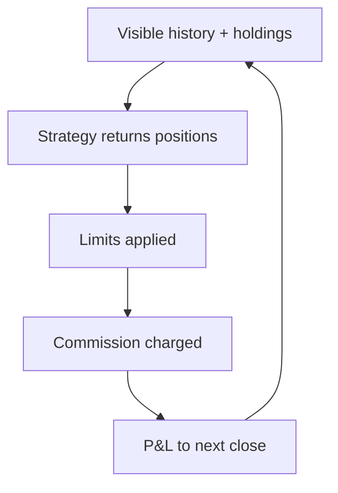

# AlgoDay

**A Devs Society competition in coding, data analysis, and decision-making under uncertainty.**

AlgoDay is a team competition where students spend four hours building Python trading strategies for a fictional financial market. Teams investigate data, test ideas, and explain their decisions. All trading uses simulated money; no real assets are bought or sold.

Every strategy is finally scored across the same **200 alternative market futures**, so a lucky backtest isn't enough. Strategies have to hold up.

> **The question teams answer:** Can you find a pattern in noisy data, turn it into a working strategy, and show that it stays useful across different possible futures?

## Contents

- [At a glance](#at-a-glance)
- [The challenge](#the-challenge)
- [The market](#the-market)
- [How a strategy is run](#how-a-strategy-is-run)
- [How strategies are scored](#how-strategies-are-scored)
- [Final evaluation](#final-evaluation)
- [Event day](#event-day)
- [Presentations and marking](#presentations-and-marking)
- [Try it locally](#try-it-locally)
- [Repository layout](#repository-layout)
- [Status](#status)

## At a glance

| Item | Detail |
|---|---|
| Organiser | Devs Society |
| Activity | Team-based Python strategy development on synthetic market data |
| Build time | Four hours, preceded by an introductory workshop |
| Participant data | 750 daily observations across 50 fictional instruments in six sectors |
| Final technical evaluation | 200 shared futures, each 250 trading days |
| Final technical score | 25th percentile of per-future scores, subject to execution and loss checks |
| Marking | Proposed 70% technical, 30% presentation (combination method still to be finalised) |
| Date, venue, attendance | To be confirmed |

## The challenge

Teams write a Python function that chooses **dollar positions in 50 instruments**. Positions can be long (profit if the price rises) or short (profit if it falls). The evaluator charges trading costs and enforces portfolio limits.

**Who it's for:** students interested in programming, data science, algorithms, or quantitative problem-solving. Basic Python is expected; trading knowledge is not. Working example strategies and an introductory workshop lower the barrier to entry.

**What it isn't:** a contest in predicting real stock prices. Simulated profit has no monetary payout.

### The participant journey

1. **Learn the interface.** Run a supplied example and inspect the results.
2. **Form a hypothesis.** Look for a relationship that might predict future price movements.
3. **Build and test.** Edit the strategy, compare results, and account for costs.
4. **Check the evidence.** Test on later portions of the history rather than tuning against one full-history score.
5. **Explain the result.** Give a short team presentation on the hypothesis, experiments, risk decisions, and limitations.
6. **Receive the final technical result.** Organisers score the strategy on 200 saved futures that teams never see during development.

## The market

The market is synthetic, so there is nothing to look up. There *are* deliberately planted, tradeable patterns in it, and finding them is the competition.

| File | Contents |
|---|---|
| `prices.csv` | 750 daily closing prices for each of 50 instruments (`INS00` to `INS49`) |
| `volumes.csv` | Matching daily share volumes, an optional research feature |
| `metadata.csv` | Sector membership: energy, financials, technology, health, industrials, consumer |

The generator combines market-wide movement, sector movement, and individual noise with discoverable effects, such as short-term reversals, slow trends, linked instruments whose relative prices converge, delayed relationships between instruments, and a small volatility-related drift. These effects are noisy, overlap, and vary in usefulness. Which instruments carry which effect is held back by the organisers.

Alongside the public data, organisers keep **150 additional historical days** and **200 saved futures** hidden until final scoring.

## How a strategy is run

The evaluator is the referee. A strategy only returns positions; it never reports its own score.



| Rule | Value |
|---|---|
| Gross exposure | Sum of \|positions\| ≤ 1,000,000 |
| Net exposure | \|Sum of positions\| ≤ 100,000 |
| Concentration | Any single position, long or short, ≤ 100,000 in absolute value |
| Commission | 0.03% (3 bps) of dollars traded |
| Runtime | 120 seconds per backtest |
| Libraries | NumPy, pandas, SciPy, scikit-learn, statsmodels, Python standard library |

If a limit is exceeded, every position is scaled down by the same factor, preserving signs and relative weights. The net cap means a team can only use the full book by balancing longs against shorts.

The model is simplified on purpose: trades execute at the close, with no slippage, financing costs, borrowing costs, or liquidity constraints.

## How strategies are scored

Each simulated run produces one score from three ingredients.

| Ingredient | In plain English |
|---|---|
| Risk-adjusted return $H$ | Average daily profit relative to how much it swings, annualised over 252 trading days |
| Drawdown factor $D$ | Shrinks toward zero as the worst peak-to-trough loss approaches 150,000 |
| Utilisation factor $U$ | Full credit once average gross exposure reaches 400,000, so a tiny, timid book can't win on ratio alone |

$$H = \sqrt{252}\cdot\frac{\mu}{\max(\sigma,\,1)}$$

$$D = \max\left(0,\ 1 - \frac{\text{max drawdown}}{150{,}000}\right)$$

$$U = \min\left(1,\ \frac{\text{average gross exposure}}{400{,}000}\right)$$

Here $\mu$ and $\sigma$ are the mean and sample standard deviation of daily net P&L, in dollars. The $\max(\sigma, 1)$ floor stops a near-zero $\sigma$ from blowing up $H$.

$$\text{Score} = \begin{cases} H \times D \times U & \text{if } H > 0 \\ H & \text{if } H \le 0 \end{cases}$$

Penalties never improve a losing score.

> **Worked example:** $H = 2$, maximum drawdown of 30,000, average gross exposure of 500,000.
>
> $D = 1 - 30{,}000/150{,}000 = 0.8$ and $U = \min(1,\ 500{,}000/400{,}000) = 1$, so
>
> $$\text{Score} = 2 \times 0.8 \times 1 = 1.6$$

> **What this rewards:** The full 1,000,000 book is a ceiling, not a target. Above 400,000 of deployment, a smaller portfolio can score better by cutting drawdown even if raw profit falls. The objective is **risk-adjusted performance with meaningful deployment**, not maximum profit.

## Final evaluation

A single favourable market period can make a weak strategy look brilliant. So every team's strategy is run through the same **200 futures**, which share the same planted structure but use different random movements. Results are directly comparable across teams.

- **Final technical score:** the **25th percentile** of the 200 per-future scores, meaning how a strategy does in a bad-but-not-catastrophic world rather than on its luckiest day.
- **Catastrophic-loss gate:** at most 10 of the 200 futures may reach a drawdown of 150,000 or more. Eleven or more make a strategy ineligible, however strong its percentile score.
- **No cherry-picking:** every path must finish successfully. A failed or timed-out path invalidates the evaluation, and failed paths are never dropped.

> **Scope of the claim:** This measures robustness within the simulated market. It is not evidence of profitability in real financial markets.

## Event day

*Working schedule, not a confirmed booking.*

| Time | Activity |
|---|---|
| 13:00 | Welcome and competition introduction |
| 13:15–14:00 | Introductory workshop |
| 14:00–18:00 | Four-hour strategy development session |
| 16:30 | Organiser scoring dry run to catch runtime or compatibility issues |
| 18:00 | Strategy deadline; final scoring and presentations begin |
| Around 19:15 | Results and prizes, depending on team count and scoring time |

The 16:30 dry run is a chance to find out if your strategy times out or breaks in the organiser environment while there's still time to fix it.

## Presentations and marking

Teams give a short (five-minute) presentation covering what they thought was happening in the market, how they checked it was real rather than noise, and how they decided their portfolio size.

The proposed split is **70% technical, 30% presentation**. The conversion of technical scores into marks, the judging rubric, and the tie-break procedure will be settled before the event and communicated to participants.

## Try it locally

The competition demo includes the real public evaluator, the full 750-day dataset, four baseline strategies, a minimal example, and a blank strategy template. It needs **Python 3.10 or newer**.

```sh
python -m pip install -r requirements.txt
python -m comp.evaluator examples/example_simple.py
```

The output is a **local score on public data**. It is not the 200-future Monte Carlo result, which is run separately by organisers after the deadline.

## Repository layout

```text
competition_demo/
  README.md
  RULES.md
  requirements.txt
  strategy.py       blank strategy template
  comp/             scoring engine and strategy execution code
  data/             prices.csv, volumes.csv, metadata.csv
  examples/         starter strategies and shared helpers
```

Hidden final-evaluation datasets, the answer key, market-generation code, and organiser-only strategy implementations are not included.

## Status

**Built:** market generator, evaluator, participant pack, calibration tools, and organiser visualiser. The public evaluator is the same scoring engine organisers use for final scoring.

The evaluator is still being fine-tuned, so scores you see locally may differ from the final scoring model.

Event logistics (date, venue, attendance, budget) and the marking split are proposals until confirmed.
